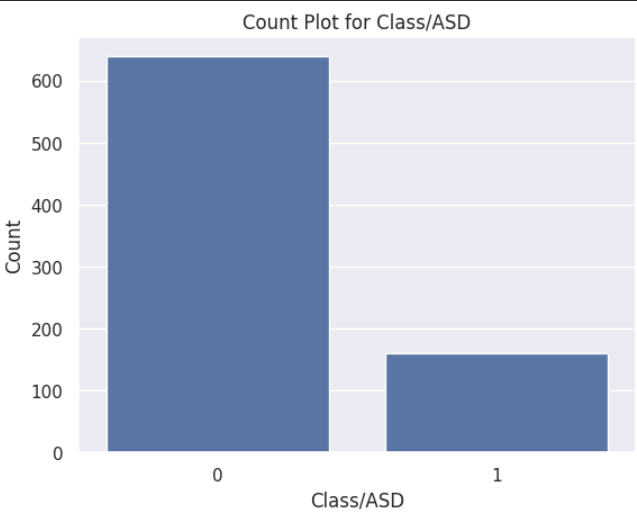

# 🧠 Autism Spectrum Disorder (ASD) Prediction
This project aims to perform Exploratory Data Analysis (EDA) and Autism Spectrum Disorder (ASD) prediction using Machine Learning techniques in Python.

Este projeto tem como objetivo realizar a **análise exploratória de dados** e a **predição de Transtorno do Espectro Autista (ASD)** utilizando técnicas de Machine Learning em Python.

## 📌 Tecnologias Utilizadas
- Python
- Pandas
- NumPy
- Matplotlib
- Seaborn
- Scikit-learn
- Jupyter Notebook

---
## 🚀 Destaques do Projeto

* **Análise de Correlação:** Identificação de que os scores A3, A4, A6 e A9 possuem a maior força preditiva no diagnóstico.
* **Tratamento de Dados Desbalanceados:** Implementação da técnica **SMOTE** para equilibrar a base de dados, aumentando a capacidade do modelo de identificar casos positivos (Classe 1).
* **Otimização:** Uso de `RandomizedSearchCV` para encontrar os melhores hiperparâmetros para algoritmos de árvore.
* **Persistência de Modelo:** Exportação do modelo final em formato `.pkl` para uso em produção.

## 📊 Análise Exploratória

### Distribuição dos Casos de ASD

> **Countplot da variável ASD**

---

## 🤖 Modelos de Machine Learning
- Pré-processamento dos dados
- Treinamento do modelo
- Avaliação de desempenho

---
## 📊 Performance do Modelo Final

O modelo alcançou os seguintes resultados no conjunto de teste:

| Métrica | Valor |
| :--- | :--- |
| **Acurácia Geral** | 82% |
| **Precisão (Classe 1)** | 59% |
| **Recall (Classe 1)** | 64% |

A matriz de confusão revelou um equilíbrio sólido, minimizando Falsos Negativos, o que é crucial em contextos de saúde.

## 📁 Estrutura do Projeto
autism-prediction/
├── data/
├── notebooks/
├── images/
├── requirements.txt
└── README.md

---

## 🚀 Como executar este projeto
-Clone o repositório:
git clone https://github.com/renataennes/ASD-Prediction-Machine-Learning.git
- Acesse o diretório do projeto:
cd ASD-Prediction-Machine-Learning
- Instale as dependências necessárias:
pip install -r requirements.txt
- Inicie o Jupyter Notebook:
Abra o notebook localizado na pasta notebooks/ e execute as células sequencialmente

---
Projetado por Renata Ennes - 2026

